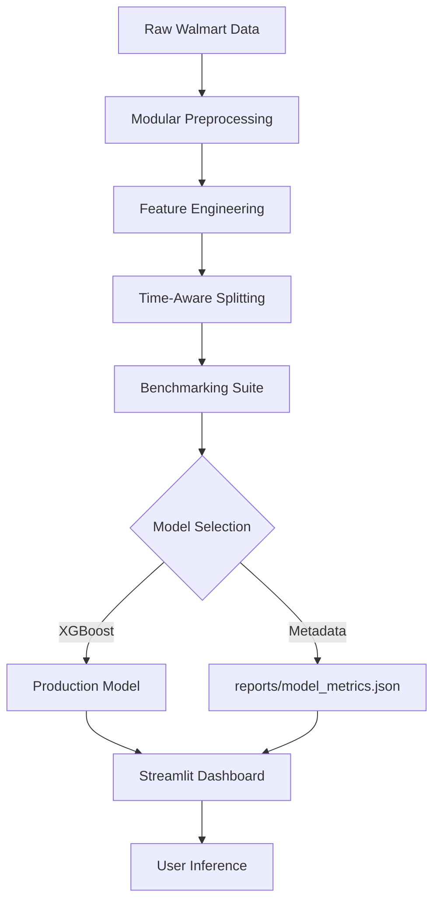

# 🛒 Enterprise Retail Demand Forecasting System

[](https://www.python.org/downloads/)
[](https://retail-forecasting.streamlit.app/)
[](https://opensource.org/licenses/MIT)

An end-to-end Machine Learning pipeline and interactive dashboard for high-precision retail sales forecasting. This system benchmarks multiple algorithms (XGBoost, Random Forest, etc.) to deliver a production-ready predictive engine for inventory and supply chain optimization.

---

## 🏗️ System Architecture



---

## 🌟 Key Highlights

-   **🔬 Multi-Model Benchmarking**: Automated evaluation of Linear Regression, Polynomial Features, Decision Trees, Random Forests, and XGBoost.
-   **📈 High Precision**: Achieved **96.7% R² Score** with XGBoost, outperforming traditional baselines.
-   **🛡️ Robust UI Guardrails**: Streamlit interface dynamically adapts its input limits (Store ID, Temperature, etc.) based on the actual training data ranges to prevent extrapolation errors.
-   **📅 Temporal Intelligence**: Uses chronological splitting (2010–2012) and feature extraction (Week of Year, Quarter, Is_Weekend) to capture seasonality.
-   **📊 Historical Insights**: Integrated dashboard with pre-aggregated trends to provide stakeholders with quick visual context.

---

## 📊 Performance Benchmarks

| Model | MAE | RMSE | R² Score |
| :--- | :--- | :--- | :--- |
| **XGBoost** | **2,115.63** | **3,026.21** | **0.9673** |
| Random Forest | 2,257.86 | 3,347.55 | 0.9600 |
| Decision Tree | 2,951.91 | 4,136.53 | 0.9389 |
| Polynomial (Deg 2) | 8,126.34 | 10,712.82 | 0.5904 |
| Linear Regression | 9,061.58 | 12,090.83 | 0.4783 |

---

## 🛠️ Project Structure

```text
├── app/
│   └── app.py              # Premium Streamlit Dashboard
├── data/
│   ├── train.csv           # Merged training entries
│   ├── stores.csv          # Store classification metadata
│   └── features.csv        # Regional economic features
├── models/
│   ├── best_model.pkl      # Production-selected binary
│   └── [AlgName].pkl       # Individual benchmarking weights
├── reports/
│   ├── figures/            # Validation & Residual plots
│   ├── model_comparison.csv # Comparative metric table
│   └── model_metrics.json  # Comprehensive feature telemetry
├── src/
│   ├── data_preprocessing.py # Merging & cleaning logic
│   ├── feature_engineering.py # Temporal & categorical extraction
│   ├── train_models.py       # Benchmarking orchestration
│   ├── evaluate_models.py    # Automatic model selection & reporting
│   └── predict.py            # Batch inference engine
└── requirements.txt         # Pinned production dependencies
```

---

## 🚀 Installation & Usage

### 1. Environment Setup
```bash
# Clone the repository
git clone https://github.com/ajpundir46/Demand-Forecasting-Retail-Time-Series-.git
cd Demand-Forecasting-Retail-Time-Series-

# Create and activate virtual environment
python -m venv venv
source venv/bin/activate  # On Windows: venv\Scripts\activate

# Install dependencies
pip install -r requirements.txt
```

### 2. Run the Full Pipeline
```bash
# Train and benchmark all models
python -m src.train_models

# Generate reports and select best model
python -m src.evaluate_models
```

### 3. Launch the Application
```bash
streamlit run app/app.py
```

---

## ☁️ Deployment Notes (Streamlit Cloud)

To ensure unpickling success on Streamlit Cloud:
-   **Python Version**: 3.12 (Recommended)
-   **Main Path**: `app/app.py`
-   **Security**: Ensure `xgboost` and `scikit-learn` are pinned in `requirements.txt` to match your local training environment versions.

---
*Developed for Retail Analytics Excellence.* 🏙️